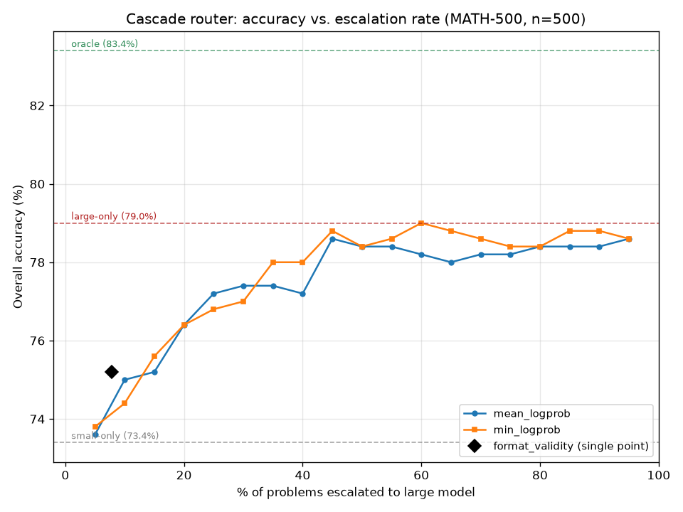

# Adaptive LLM Routing for Mathematical Reasoning

## Project Overview

This project builds an inference-time cascade router between two math-specialized
LLMs of different sizes — [Qwen2.5-Math-1.5B-Instruct](https://huggingface.co/Qwen/Qwen2.5-Math-1.5B-Instruct)
(small) and [Qwen2.5-Math-7B-Instruct](https://huggingface.co/Qwen/Qwen2.5-Math-7B-Instruct)
(large) — that sends each problem to the small model first and escalates to
the large model only when a confidence signal says the small model is
likely wrong. The goal is not maximum accuracy; it's characterizing the
accuracy-vs-compute tradeoff and showing where on that curve a cascade can
land, using [MATH-500](https://huggingface.co/datasets/HuggingFaceH4/MATH-500)
as the benchmark.

Same-family, math-specialized models were chosen deliberately so that model
*size* is the only variable being studied — see
[`docs/DECISIONS.md`](docs/DECISIONS.md) for the full reasoning behind this
and every other design choice, and [`docs/PROJECT_PLAN.md`](docs/PROJECT_PLAN.md)
for the full research design.

## Results (Phase 2 baseline + Phase 3 heuristic sweep, n=500)

| | Accuracy | Correct/Total |
|---|---|---|
| Small only (1.5B) | 73.4% | 367/500 |
| Large only (7B) | 79.0% | 395/500 |
| Oracle (best of either, per-problem) | 83.4% | 417/500 |



Escalating the hardest ~30% of problems (by small-model token-logprob
confidence) closes most of the gap to the large-only baseline; escalating
further than that produces almost no additional accuracy for the rest of
the compute spent — see `results/phase3_sweep.csv` for the full sweep and
`docs/DECISIONS.md` (2026-08-12 entries) for the run-by-run writeup.

**Methodology note:** the table and plot above are the full-500 numbers
(thresholds chosen and evaluated on the same 500 problems). A 350/150
train/held-out split (`results/train_test_split.json`, seed=42, stratified
by subject) was added so Phase 3 could also be checked honestly on unseen
data — see `docs/DECISIONS.md` (2026-08-13) for the held-out re-evaluation
and what did (and didn't) change. Short version: no evidence of meaningful
threshold overfitting, though the 150-problem held-out set is small enough
that this isn't a strong guarantee. Phase 4's learned router will train on
the 350-problem split and report final numbers on the 150-problem held-out
split, for consistency.

**Known limitations, stated plainly:** `level` (difficulty) isn't currently
captured in the result files, only `subject` (recoverable from
`unique_id`), so a difficulty-stratified breakdown isn't possible yet.
Phase 4 (a learned router) is the current next step — see
`docs/PROJECT_PLAN.md` §7 for phase status.

## Reproducing the Experiments

This project runs on **Kaggle Notebooks** (T4×2 accelerator), not a local
GPU or a PACE-style SSH cluster — `vllm` needs an NVIDIA GPU, and the two
models don't fit together on a single T4 (see `docs/DECISIONS.md`,
2026-08-09). Every step below is a Kaggle notebook cell.

### 1. Create the Kaggle notebook

New Notebook → **Settings → Accelerator → GPU T4 x2** → **Internet: On**
(needed to clone the repo and download models/dataset from the Hub).

### 2. Clone the repository

```bash
!git clone https://github.com/DamodarE/adaptive-llm-routing.git
%cd adaptive-llm-routing
```

### 3. Check the Python version, then install dependencies

`math-verify` requires Python >=3.10 — `pilot.py` checks this itself and
exits with a clear error if it's not met, but it's worth confirming first:

```bash
!python --version
!pip install -q -r requirements.txt
```

### 4. Run the baselines (Phase 2)

Each model is a separate process invocation — `vllm` doesn't support two
engines running concurrently in one process, and the two models need
different GPU footprints (small model: one GPU; large model:
`tensor_parallel_size=2`, both GPUs). See the header comment in `pilot.py`
for why.

```bash
!CUDA_VISIBLE_DEVICES=0 python notebooks/pilot.py --model small --gpu 0
!CUDA_VISIBLE_DEVICES=0,1 python notebooks/pilot.py --model large --gpu 0,1
```

This writes `results/pilot_small.json` and `results/pilot_large.json`
(500 problems each by default; pass `--n` to run a smaller pilot subset).

### 5. Compare the baselines

```bash
!python notebooks/compare_pilot.py
```

Prints a side-by-side accuracy/latency table plus the oracle ceiling.

### 6. Re-run the small model with per-token logprobs (Phase 3 prep)

```bash
!CUDA_VISIBLE_DEVICES=0 python notebooks/rerun_small_with_logprobs.py
```

Re-runs *only* the small model (reusing `pilot.py`'s model/dataset setup
directly, so the two stay identical) with `logprobs=1` enabled, and writes
`results/small_with_logprobs.json` with `mean_logprob`/`min_logprob` added
per problem. Does not touch `results/pilot_large.json`.

### 7. Run the threshold sweep

```bash
!python notebooks/router_sweep.py
```

No GPU needed — reads the two JSON files above, sweeps ~20 percentile
thresholds per confidence signal (`mean_logprob`, `min_logprob`, plus one
operating point for `format_validity`), and writes
`results/phase3_sweep.csv`.

### 8. Plot the tradeoff curve

```bash
!python notebooks/plot_router_sweep.py
```

Also no GPU needed. Reads `results/phase3_sweep.csv` (and the pilot JSONs,
if present, for the small-only/large-only/oracle reference lines) and
writes `results/router_sweep_plot.png`.

### 9. Create the train/held-out split

```bash
!python notebooks/make_split.py
```

No GPU needed. Reads `results/pilot_small.json` for the 500 `unique_id`s,
splits them 350/150 (seed=42, stratified by subject), and writes
`results/train_test_split.json`. Deterministic — rerunning it reproduces
the exact same split.

### 10. Re-evaluate Phase 3 on held-out data

```bash
!python notebooks/router_sweep_heldout.py
```

No GPU needed. Selects thresholds using only the 350-problem train split,
evaluates them on the 150-problem held-out split, prints a comparison
against the full-500 numbers (normalized for each split's own baseline —
see `docs/DECISIONS.md`, 2026-08-13), and writes
`results/phase3_sweep_heldout.csv`. Does not overwrite
`results/phase3_sweep.csv`.

## Notes

- Steps 4–10 must run in order — each later step reads a file written by
  an earlier one, and any script that reads a prior step's output will
  exit cleanly with a message telling you which input file is missing
  rather than crashing.
- Exact package versions weren't pinned or recorded from the Kaggle runs
  behind the numbers above — `requirements.txt` lists packages, not pinned
  versions. If you rerun this and get different results, that's the first
  thing to check; `vllm` and `transformers` both move fast.
- `vllm`'s greedy decoding (`temperature=0`) is not guaranteed bit-for-bit
  reproducible run-to-run — batch composition can affect floating-point
  accumulation order. Small (single-digit-problem) differences between runs
  are expected, not a bug.
- If running with a different accelerator (e.g. a single larger GPU instead
  of T4x2), `tensor_parallel_size` and the `CUDA_VISIBLE_DEVICES` values in
  step 4 will need to change accordingly.

## Repository Structure

```
adaptive-llm-routing/
│
├── notebooks/
│   ├── phase1_env_setup.py          # Phase 1 environment sanity check
│   ├── pilot.py                     # Core harness: generate + grade one model on MATH-500
│   ├── compare_pilot.py             # Small vs. large comparison table + oracle
│   ├── rerun_small_with_logprobs.py # Small model rerun with per-token logprobs
│   ├── router_sweep.py              # Threshold sweep over confidence signals
│   ├── plot_router_sweep.py         # Plots results/phase3_sweep.csv
│   ├── make_split.py                # Reproducible 350/150 train/held-out split
│   └── router_sweep_heldout.py      # Phase 3, fit on train / evaluated on held-out
│
├── src/
│   └── grading.py                   # math-verify wrapper (LaTeX/tuple-aware grading)
│
├── docs/
│   ├── PROJECT_PLAN.md              # Research design, scope, phase status
│   └── DECISIONS.md                 # Dated log of every design decision and why
│
├── results/                         # JSON run outputs, phase3_sweep.csv, plot
├── data/                            # (unused — MATH-500 is streamed from the
│                                     #  HF Hub each run, not cached locally)
├── requirements.txt
├── LICENSE
└── README.md                        # This file
```
